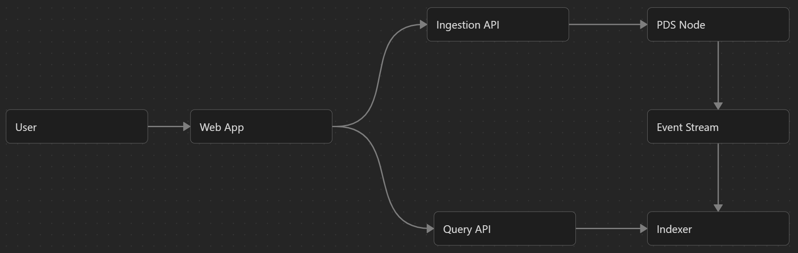
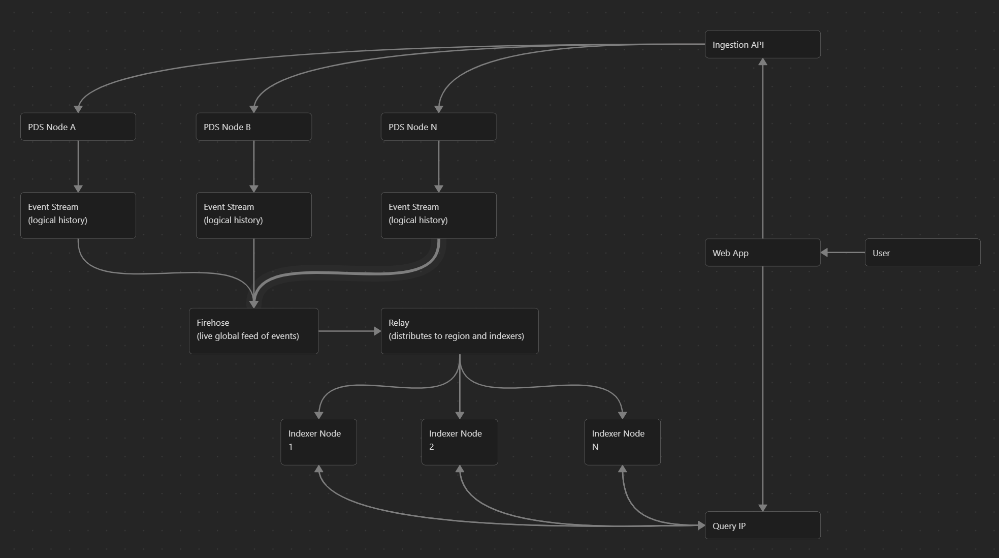

# Architecture
## Overview
The MVP B.L.U.E. System is composed of three primary layers:
- Personal Data Servers (PDS) - data ownership layer
- Indexer - aggregation and structure computation layer
- App / UI Layer - presentation and interaction layer

These components are intentionally separated to ensure:
- data ownership remains local
- structure is derived, not stored centrally
- multiple interpretations of the same data are possible

## Achitecture Diagrams
### Core MVP Architecture

### Architecture at Scale

## System Components (MVP)
### 1. Personal Data Server (PDS)
#### Role
The PDS is the source of truth for all user data.

Each PDS:
- belongs to a single user or organisation
- stores immutable ATProto-style records
- emits append-only record streams

#### Responsibilities
- Store:
    - `blue.article`
    - `blue.method`
    - `blue.vote`
- Maintain CID-addressed immutable records
- Expose record streams for external consumers
- Ensure data portability via DID identity

#### Key Properties
- No global state
- No awareness of other PDS nodes
- No indexing responsibility
- Fully independent operation

### 2. Indexer (Aggregation + Computation Layer)
#### Role
The Indexer is a read-only computation system that builds structured knowledge views from distributed PDS data.

It is NOT authoritative and does NOT store canonical content.

#### Responsibilities
- Data ingestion: Consume record streams from multiple PDS nodes
- Aggregation - collects:
    - `blue.article`
    - `blue.method`
    - `blue.vote`
- Structural computation - grouped by:
    - `subjectArea`
    - `difficultyLevel`
- Derived hierarchy - build structured learning graph and organise progression paths
- Validation rules
    - Ensure prerequisite levels exist per subject area
    - Detect missing hierarchy levels
    - Flag incomplete progression chains
- Output - Produce queryable structured dataset for the App layer

#### Key Properties
- Stateless with respect to canonical data
- Can be replaced or replicated
- Not a system of authority
- Pure computation layer

#### MVP Constraint
In the MVP:
- Only one Indexer exists
- It aggregates across multiple PDS nodes
- It produces a single derived hierarchy view

This enables validation of:
- cross-PDS aggregation
- hierarchy computation correctness
- method linking across nodes
- vote aggregation logic

### 3. App / UI Layer
#### Role
The App layer is responsible for presenting structured learning views to users.
It consumes only Indexer outputs.

#### Responsibilities
- Query Indexer outputs
- Render hierarchical learning structure
- Display:
    - articles grouped by subject
    - difficulty progression
    - methods linked to base articles
- Enable navigation through knowledge graph

#### Key Properties
- Stateless regarding data structure
- No direct PDS access required (MVP assumption)
- No computation of hierarchy
- Can support multiple Indexers (future feature)

### Event Model (MVP Simplification)
The MVP system does NOT use a separate event infrastructure.

Instead:
- PDS record streams act as the event source
- Indexer subscribes directly to these streams

This ensures:
- simplicity
- ATProto alignment
- no additional messaging layer

## Decentralisation Model
### Decentralised components
#### Data layer (fully decentralised)
- PDS nodes
- content ownership
- record storage

#### Creation layer (fully decentralised)
- articles
- methods
- votes

### Centralised components (MVP only)
- Indexer (single instance)
- App aggregation layer

These are:
- not authoritative
- replaceable
- temporary simplifications for MVP validation

## Derived Hierarchy Model
The derived hierarchy is:
> A computed representation of all available learning content grouped by subject and difficulty level.

It is NOT stored in any PDS.

It is:
- recomputed from raw records
- ephemeral
- reconstructible at any time

## System Constraints
### Hard constraints
- PDS must never depend on Indexer
- Indexer must never modify PDS data
- App must never define structure
- All records must remain immutable

### Soft constraints (MVP assumptions)
- Single Indexer instance
- No relay layer required
- No cross-PDS synchronisation at storage level
- No trust/reputation system active

### Extensibility (Post-MVP)
The architecture is designed to support:

#### Multi-indexer system
- independent interpretations of same data
- comparative structural views
- non-authoritative ranking systems

#### Relay layer (optional)
- real-time distributed update propagation

#### Trust layer (optional)
- reputation and validation systems
- cryptographic or community-based signals

These are intentionally excluded from MVP scope.

## Summary
B.L.U.E. architecture enforces a strict separation of concerns:
- PDS - owns data
- Indexer - interprets structure
- App - presents structure

And crucially:
> No single layer has full control over meaning, storage, and presentation simultaneously.