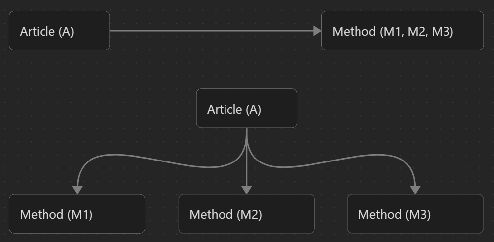
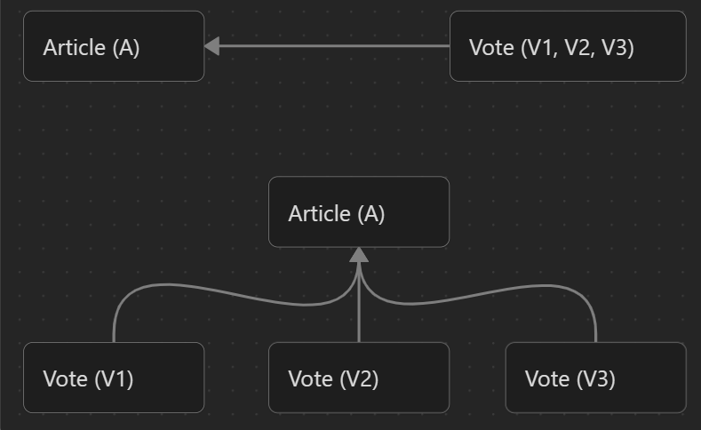
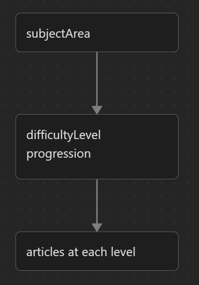

# Data Model
## Overview
This document defines the canonical data structures used across the B.L.U.E. System.

All data is:
- immutable
- CID-addressed
- stored in Personal Data Servers (PDS)
- compatible with ATProto-style record semantics

The system currently defines three core record types:
- `blue.article`
- `blue.method`
- `blue.vote`

## Shared Record Principles

All records follow these rules:
- Immutability
- Identity
- Structure 
### Immutability
- Records are never modified in-place
- Updates create a new CID

### Identity
- All authors are identified using DID
- All records are globally addressable via URI

### Structure
Each record:
- is self-contained
- is independently retrievable
- does not depend on central schema enforcement at runtime

## Records
- Article
- Method
- Vote
### 1. Article (`blue.article`)
#### Definition
An article is a procedural learning unit.

It represents a structured “how-to guide” for understanding or performing a concept or task within a defined difficulty level.

It is not a general document type.

#### Data Model

```json
{
	"$type": "blue.article",
	"uri": "at://did:plc:user123/blue.article/server001",
	"cid": "bafy...",
	"author": "did:plc:user123",
	"createdAt": "2026-05-24T10:00:00Z",
	"title": "How to Set Up a Basic Linux Web Server",
	"content": "Step 1: Provision a VPS...\nStep 2: SSH into server...\nStep 3: Install Nginx...",
	"subjectArea": "server_administration",
	"difficultyLevel": 1,
	"status": "published"
}
```

#### Fields
##### Core Fields
- `uri`: ATProto-style identifier for the record
- `cid`: Content hash ensuring immutability
- `author`: DID of the creator
- `createdAt`: Timestamp of creation

##### Content
- `title`: Human-readable title of the learning unit
- `content`:  Procedural explanation of the concept / structured step-by-step guide
##### Future expansion (non-MVP)
The `content` field is designed to evolve into a **multi-modal learning container**, supporting:

- images (diagrams, annotations)
- video walkthroughs
- interactive elements
- embedded code execution examples

This does NOT change the conceptual model:
> an article remains a procedural learning unit

##### Classification
- `subjectArea`:  Groups related knowledge domains (e.g. `networking`, `databases`)
- `difficultyLevel`:  Defines progression in a subject area
    - Level 1 = foundational (no prerequisites)
##### State
- `status`: Controls visibility in Indexer outputs - `draft` | `published`

#### Semantic Rules
- Articles MUST belong to exactly one `subjectArea`
- Articles MUST have a single `difficultyLevel`
- Articles are part of a strict progression graph
- Higher levels assume lower-level ecosystem existence (validated by Indexer)

### 2. Method (`blue.method`)
#### Definition
A method is an alternative explanation of the same knowledge unit.
It does NOT introduce new conceptual levels.

It exists to:
- reframe understanding
- simplify explanation
- offer alternative learning approaches

#### Data Model

``` json
{
	"$type": "blue.method",
	"uri": "at://did:plc:user789/blue.method/server001-m1",
	"cid": "bafy...",
	"author": "did:plc:user789",
	"createdAt": "2026-05-24T12:00:00Z",
	"baseArticle": "at://did:plc:user123/blue.article/server001",
	"title": "How to Set Up a Web Server Using Docker",
	"content": "Step 1: Install Docker...\nStep 2: Pull nginx image...\nStep 3: Run container..."
}
```

---

#### Fields
##### Core
- `uri`
- `cid`
- `author`
- `createdAt`

Same semantics as `blue.article`.

##### Linking
- `baseArticle`: Reference to the article being reinterpreted. Must point to a valid `blue.article` URI

##### Content
- `title`: alternative framing of the same concept
- `content`: alternative procedural explanation

#### Semantic Rules
- Must reference exactly one `baseArticle`
- Must NOT increase difficulty level
- Must remain within same conceptual scope as base article
- Must not redefine subject classification independently

### 3. Vote (`blue.vote`)
#### Definition
A vote is a **signal record** used for aggregation and ranking.
It does NOT modify content.

It is processed exclusively by the Indexer.

#### Data Model

```json
{
	"$type": "blue.vote",
	"uri": "at://did:plc:user456/blue.vote/vote789",
	"cid": "bafy...",
	"createdAt": "2026-05-24T11:00:00Z",
	"article": "at://did:plc:user123/blue.article/server001",
	"value": 1
}
```

---

#### Fields
##### Core
- `uri`
- `cid`
- `createdAt`

##### Target
- `article`: URI of the article being voted on

##### Value
- `value`: Numeric vote signal (e.g. +1, -1). Used for aggregation only

#### Semantic Rules
- Votes are immutable
- Votes are independent records (not embedded in articles)
- Votes do not modify article state
- Votes may be aggregated across all PDS nodes

## Cross-Record Relationships
### Article & Method
- One article can have many methods
- Methods must reference a base article




### Article & Vote
- Many votes per article
- Votes are aggregated externally



### Subject & Difficulty Graph
Articles form a structured graph.
This structure is NOT stored in PDS.
It is computed by the Indexer.



## Indexer Dependency Rules
The data model explicitly enforces:
- PDS does NOT require knowledge of relationships
- Indexer reconstructs all relationships
- App consumes only reconstructed views

This ensures:
> data is independent of interpretation layer

## Versioning Strategy (Implicit via CID)
There is no explicit version field.

Instead:
- updates = new record with new CID
- history = chain of immutable records

This applies to:
- articles
- methods
- votes

## Future Extensions (Non-MVP)
The model is designed to later support:

### Multimedia articles
- image attachments
- video walkthroughs
- diagrams
- interactive learning blocks

### Structured enrichment
- step tagging
- prerequisites per step
- embedded quizzes or checks

### Expanded vote types
- reputation signals
- confidence scoring
- contextual feedback

These are **extensions of the same model**, not replacements.

## Summary
The B.L.U.E. data model is built on:
- immutable records
- explicit relationships
- distributed ownership
- external computation of structure

> Data defines content. The system defines structure. Neither controls the other.