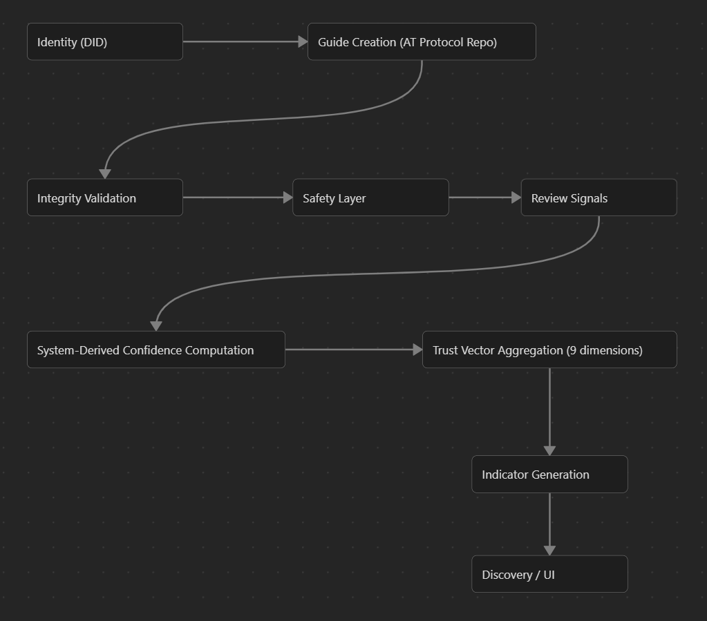

## 1. Overview

B.L.U.E. is a decentralised educational knowledge system built on the AT Protocol.

It separates knowledge into four independent layers:
1. Identity (who created content)
2. Integrity (is content authentic and untampered)
3. Trust (how reliable knowledge is)
4. Safety (can content be distributed or shown)

Post-MVP, Guides may include:
- text
- images
- video
- code
- mixed media instructional content

Each system operates independently to prevent any single layer from controlling truth, authenticity, or distribution.

Systems:
- [Identity Systems](#3-identity-system-at-protocol-layer)
- [Integrity Systems](#4-integrity-system-structural-authenticity-layer)
- [Trust Vector Systems](#5-trust-vector-system-epistemic-reliability-layer)
- [Review System](#6-review-system-signal-generation-layer)
- [Safety Layer](#7-safety-layer-policy--distribution-control-system)

## 2. Core Principle
> No single system determines identity, reliability, and distribution simultaneously.

## 3. Identity System (AT Protocol Layer)
### 3.1 Overview
Identity is fully delegated to AT Protocol (DIDs + PDS).
B.L.U.E. does not implement authentication.

### 3.2 Identity Model

```
did:plc:abc123xyz
```

Resolves to:
- Personal Data Server (PDS)
- repository of records
- signed commit history

### 3.3 Identity Roles
- Creator (produces Guides: text, image, video, or mixed media)
- Reviewer (generates evaluation signals)
- Contributor (suggests edits or improvements)

All roles are context-based and not fixed accounts.

### 3.4 Principle
Identity is external, portable, and not controlled by B.L.U.E.

## 4. Integrity System (Structural Authenticity Layer)
### 4.1 Purpose
Ensures Guides are:
- authentic
- untampered
- traceable through AT Protocol history

### 4.2 What Integrity Verifies
- DID validity
- commit chain consistency
- repository authenticity
- record schema correctness
- version history integrity
- media asset linkage integrity (images/video/code attachments)

### 4.3 Integrity States
- Valid
- Updated
- Modified
- Broken
- Unknown

### 4.4 Principle
Integrity ensures content is real, not whether it is correct.

## 5. Trust Vector System (Epistemic Reliability Layer)
### 5.1 Purpose
Evaluates how reliable and useful a Guide is across multiple independent dimensions

### 5.2 Trust Vector (9 Dimensions Overview)
Each Guide is evaluated across the following dimensions:

```json
{
    "provenance": 0.82,
    "citation_quality": 0.91,
    "reproducibility": 0.77,
    "reviewer_reliability": 0.63,
    "consensus_stability": 0.55,
    "educational_effectiveness": 0.88,
    "cross_network_agreement": 0.60,
    "challenge_resistance": 0.70,
    "temporal_reliability": 0.80
}
```

### 5.3 Trust Dimensions
#### 1. Provenance Score
Tracks where content came from and how it evolved.

##### Signals
- cryptographic author identity
- edit history integrity
- version lineage
- reviewer signatures
- contribution stability

##### Purpose
Ensures content is traceable and accountable.

#### 2. Citation Quality Score
Evaluates the reliability of supporting evidence.

##### Signals
- primary vs secondary sources
- citation diversity
- source credibility history
- archival availability
- reproducibility of sources

##### Purpose
Improves evidence transparency and source reliability.

#### 3. Reproducibility Score
Measures whether claims can be independently verified.

Applies to
- code examples
- mathematical explanations
- scientific claims
- engineering guides

##### Signals
- executable validation
- deterministic outputs
- benchmark replication
- simulation consistency

##### Purpose
Encourages verifiable educational content.

#### 4. Reviewer Reliability Score
Measures reviewer trustworthiness over time.

##### Signals
- historical review accuracy
- successful challenge rate
- domain consistency
- correction acceptance history

##### Purpose
Ensures reviewer trust is earned rather than assumed.

#### 5. Consensus Stability Score
Measures how stable agreement remains over time.

##### Signals
- consistency across reviewers
- independent convergence
- disagreement trends
- revision stability

##### Purpose
Helps distinguish stable knowledge from rapidly fluctuating consensus.

#### 6. Educational Effectiveness Score
Measures how effectively content teaches users.

##### Signals
- learner completion rates
- comprehension feedback
- downstream skill improvement
- assessment success
- correction frequency

##### Purpose
Ensures educational usefulness is considered alongside factual accuracy.

#### 7. Cross-Network Agreement Score
Measures agreement between independent trust providers.

##### Signals
- federated node agreement
- external validation alignment
- diversity-weighted consensus

##### Purpose
Supports decentralized trust ecosystems without requiring central authority.

#### 8. Challenge Resistance Score
Measures how well content survives structured criticism.

##### Signals
- rebuttal handling
- unresolved disputes
- contradiction management
- review survivability

##### Purpose
Improves resilience against misinformation and weak claims.

#### 9. Temporal Reliability Score
Measures long-term informational stability.

##### Signals
- longevity of correctness
- historical consistency
- revalidation outcomes

##### Purpose
Prevents outdated trust from becoming permanently fixed.


### 5.4 Trust States
- Trusted
- Stable
- Emerging
- Contested
- Experimental

Trust States are used for:
- ranking logic (light weighting)
- classification
- grouping content in discovery
- deciding how aggressively to surface content
- filtering by user preference (optional advanced mode)

They compress the full vector:
```
9D Trust Vector --> Trust State
```

Example:
```
High reproducibility + strong citations + stable consensus = Stable
```

Trust States is the internal classification of the guide’s epistemic condition


### 5.5 Trust Outputs
| Trust Dimension | High Indicator | Medium Indicator | Low / Warning Indicator |
| --------------- | -------------- | ---------------- | ----------------------- |
| 1. Provenance | Provenance verified<br>Contribution history stable | Provenance partially established | Provenance weak or incomplete |
| 2. Citation Quality | Evidence strongly supported<br>High-quality citations | Citation quality mixed | Weak supporting evidence<br>Heavy reliance on secondary sources |
| 3. Reproducibility | Independently reproducible | Partial reproducibility confirmed | Reproducibility unverified |
| 4. Reviewer Reliability | Reviewer reliability strong | Reviewer reliability developing | Reviewer reliability uncertain |
| 5. Consensus Stability | Strong consensus stability | Moderate disagreement present | Significant unresolved disagreement |
| 6. Educational Effectiveness | Educational clarity strong | Advanced knowledge assumed | Learner comprehension inconsistent |
| 7. Cross-Network Agreement | Cross-network agreement strong | External validation partially aligned | External systems diverge |
| 8. Challenge Resistance | Survived extensive review | Some challenges remain unresolved | Criticisms remain unresolved |
| 9.Temporal Reliability | Stable over time | Topic evolving gradually | Information may become outdated rapidly |

They are used for:
- UI labels
- user understanding
- transparency
- educational feedback

They answer: Why is this Guide considered reliable or not?

### 5.6 Principle
Trust evaluates epistemic reliability, not permission or authenticity.

## 6. Review System (Signal Generation Layer)

### 6.1 Purpose
Reviewers generate structured signals used by the Trust Vector.
They do NOT approve or reject Guides.

### 6.2 Reviewer Actions
- evaluate claims inside Guides
- validate reproducibility
- assess citations
- flag disagreements
- attach domain expertise context

### 6.5 System-Derived Confidence
Confidence is NOT set by reviewers.
Instead B.L.U.E. computes confidence based on observable reliability signals.

#### Inputs
- reviewer reliability history
- evidence interaction signals
- domain alignment
- peer agreement
- claim uncertainty

#### Output - Atomic Review Signal

```json
{
  "guide_id": "tcp_guide",
  "claim_id": "c12",
  "assessment": "supported",
  "system_confidence": 0.74
}
```

### 6.4 Principle
Reviewers provide observations; the system determines weight.

## 7. Safety Layer (Policy & Distribution Control System)
### 7.1 Purpose
Determines whether Guides can be:
- distributed
- recommended
- surfaced in discovery

### 7.2 Included Systems
- content classification (harmful / sensitive / dual-use)
- legal compliance filtering
- distribution rules
- safety tiering system
- warning overlays
- access friction controls

### 7.3 Safety Tiers
- Allowed
- Restricted Visibility
- Safety Flagged
- Hard Blocked

### 7.4 Principle
Safety controls distribution, Trust controls interpretation, Integrity controls authenticity.

## 8. System Flow


## 9. Separation of Concerns

| Layer     | Question Answered           | Can Block Content |
| --------- | --------------------------- | ----------------- |
| Identity  | Who created this Guide?     | No                |
| Integrity | Is this Guide authentic?    | No                |
| Review    | What do evaluators observe? | No                |
| Trust     | How reliable is it?         | No                |
| Safety    | Should it be distributed?   | Yes               |

## 10. Core Principles

- Trust is emergent, not assigned
- Confidence is system-inferred, not declared
- Reviews are signals, not decisions
- Safety is independent of epistemic truth
- Guides are multi-media by design (text, image, video, code)

## 11. Final Summary
B.L.U.E. consists of:
- Identity (AT Protocol DID system)
- Integrity (authenticity layer)
- Review System (signal generation layer)
- System-Derived Confidence (weighting mechanism)
- Trust Vector (9-dimensional epistemic model)
- Safety System (distribution enforcement layer)

B.L.U.E. separates identity, authenticity, observation, reliability, and safety into independent systems so knowledge can be evaluated transparently without centralised control.